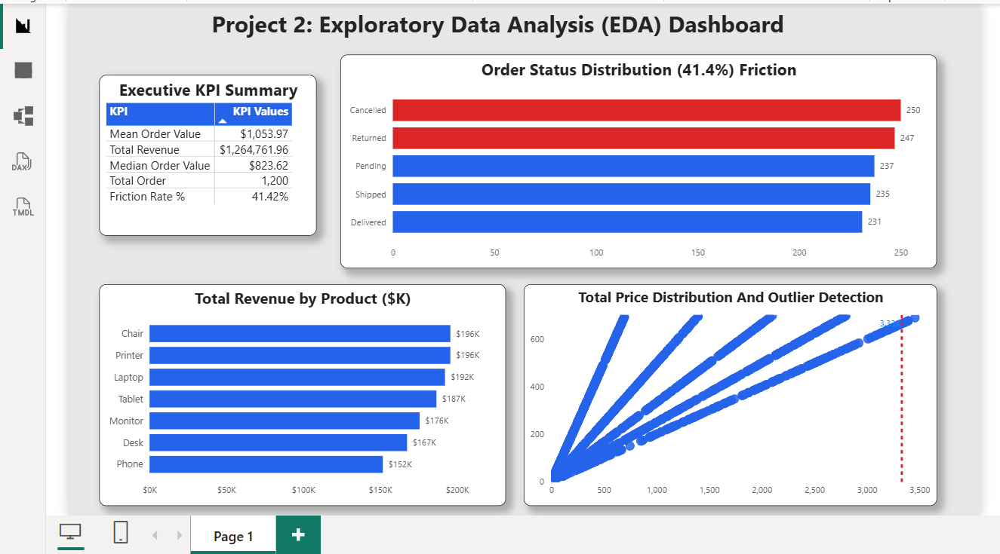

# Project 2: Exploratory Data Analysis (EDA) - Retail Transactions Diagnostic

## 📌 Executive Summary
This project analyzes **1,200 retail transaction records** to evaluate revenue trends, identify statistical distribution anomalies, detect extreme price outliers, and measure fulfillment friction.

---

## 📊 Key Business Insights & Findings

* **Total Revenue:** $1,264,761.96 across 1,200 orders.
* **Right-Skewed Distribution:** The **Mean Order Value ($1,053.97)** is noticeably higher than the **Median Order Value ($823.62)**, proving that revenue is heavily influenced by bulk purchases.
* **High Operational Friction:** **41.42%** of all orders fail to complete (**250 Cancelled** and **247 Returned**), highlighting potential fulfillment or product satisfaction issues.
* **Outlier Detection:** **8 extreme orders** exceeded the Interquartile Range (IQR) upper limit threshold of **$3,330.41**.
* **Top Revenue Drivers:** **Chairs ($195.6K)** and **Printers ($195.6K)** generate the highest overall sales revenue.

---

## 🛠️ Diagnostics & Methodology
- **Data Cleaning:** Imputed missing values in `CouponCode` (25.75% missing) with `"NO_COUPON"`.
- **IQR Threshold Formula:** Outliers identified where $\text{TotalPrice} > Q3 + 1.5 \times IQR$.
- **Visualization Tool:** Power BI Desktop (Explicit DAX Measures, Scatter Plot Outlier Detection, Custom Friction Categorization).

---

## 💡 Strategic Recommendations
1. **Investigate Returns & Cancellations:** Analyze supply chain logs for the 41.42% non-delivered orders to prevent revenue leakage.
2. **VIP Customer Care:** Create dedicated processing channels for high-value orders exceeding $3,300 to ensure 100% completion rates.

*Prepared by Blessing Ogbuzuo | DecodeLabs Data Analytics Internship, Batch 2026*
